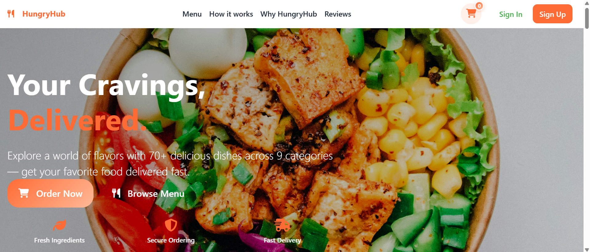
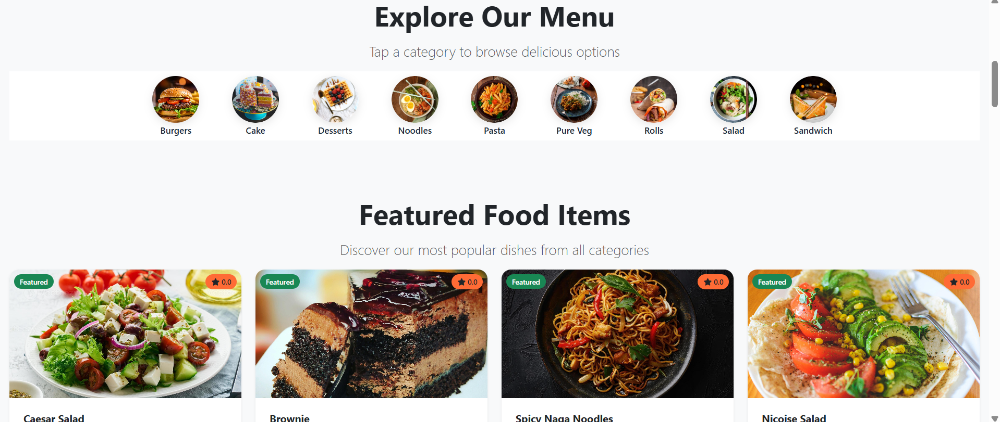
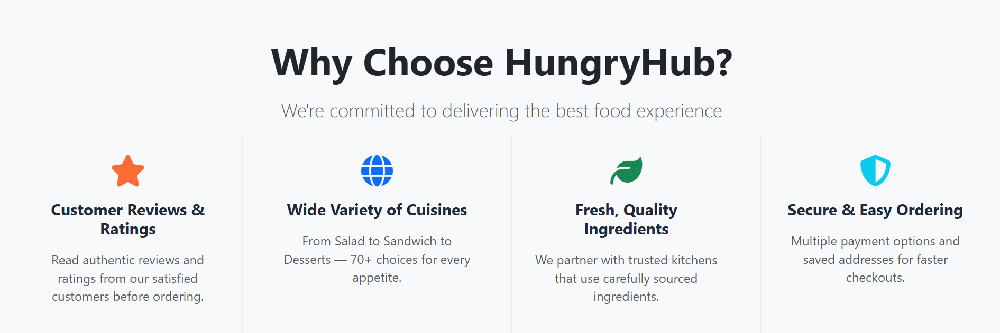
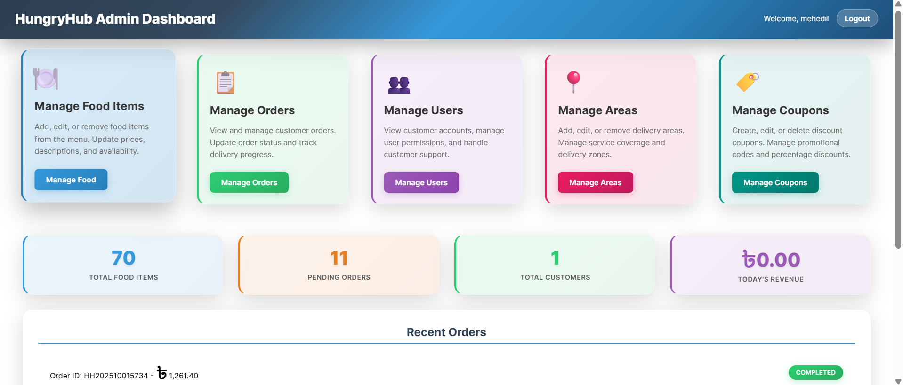

# 🍽️ HungryHub - Online Restaurant Management System


A full-stack **Online Restaurant Management System** developed using **PHP, MySQL, HTML, CSS, Bootstrap, and JavaScript**. HungryHub allows customers to browse menus, place food orders, manage their carts, and leave reviews, while providing administrators with a powerful dashboard to manage food items, orders, customers, delivery areas, and coupons.

---

## 📌 Features

### 👤 Customer Features

- User Registration & Login
- Browse food by category
- View detailed food information
- Search food items
- Shopping cart
- Secure checkout
- Place orders
- Order history
- Food ratings & reviews
- Responsive user interface

### 👨‍💼 Admin Features

- Admin Dashboard
- Manage Food Items
- Manage Orders
- Manage Users
- Manage Delivery Areas
- Manage Coupons
- View Daily Revenue
- Order Statistics
- Customer Management

---

# 🛠️ Built With

| Technology | Purpose |
|------------|----------|
| PHP | Backend Development |
| MySQL | Database |
| HTML5 | Structure |
| CSS3 | Styling |
| Bootstrap 5 | Responsive UI |
| JavaScript | Client-side Functionality |
| Font Awesome | Icons |
| XAMPP | Local Development Server |

---

## 📷 Screenshots

### 🏠 Home Page



---

### 🍽️ Menu Section



---

### ⭐ Why Choose HungryHub



---

### 👨‍💼 Admin Dashboard



---

# 🍔 Food Categories

- 🍔 Burgers
- 🍰 Cake
- 🍨 Desserts
- 🍜 Noodles
- 🍝 Pasta
- 🥗 Salad
- 🥪 Sandwich
- 🌯 Rolls
- 🥦 Pure Veg

---

# ⚙️ Installation

## Clone the repository

```bash
git clone https://github.com/MehediNoorNeo/Online-Restaurant-HungryHub.git
```

## Move to the project

```bash
cd Online-Restaurant-HungryHub
```

## Setup XAMPP

- Copy the project into:

```
xampp/htdocs/
```

- Start:

```
Apache
MySQL
```

## Import Database

1. Open phpMyAdmin
2. Create a database
3. Import the SQL file

---

## Configure Database

Update your database credentials inside the database configuration file.

Example:

```php
$host = "localhost";
$user = "root";
$password = "";
$database = "hungryhub";
```

---

## Run the Project

Open your browser:

```
http://localhost/Online-Restaurant-HungryHub
```

---

# 📂 Main Modules

- Authentication
- Customer Dashboard
- Food Menu
- Cart
- Checkout
- Orders
- Reviews
- Coupons
- Admin Panel
- User Management
- Area Management

---

# 📊 Admin Dashboard

The administrator can:

- Add/Edit/Delete Food Items
- Manage Customer Orders
- Track Pending Orders
- Manage Customers
- Create Coupons
- Manage Delivery Areas
- View Today's Revenue
- View Total Food Items

---

# 🎯 Project Objectives

- Simplify online food ordering
- Improve restaurant management
- Provide an intuitive customer experience
- Reduce manual order processing
- Offer centralized administration

---

# 🚀 Future Improvements

- Online Payment Gateway
- Email Verification
- SMS Notifications
- Delivery Tracking
- Wishlist
- Restaurant Analytics
- REST API
- Multi-vendor Support
- Mobile Application

---

# 👨‍💻 Author

**Mehedi Hasan**

- GitHub: https://github.com/MehediNoorNeo

---

# ⭐ Support

If you like this project, consider giving it a **⭐ Star** on GitHub.